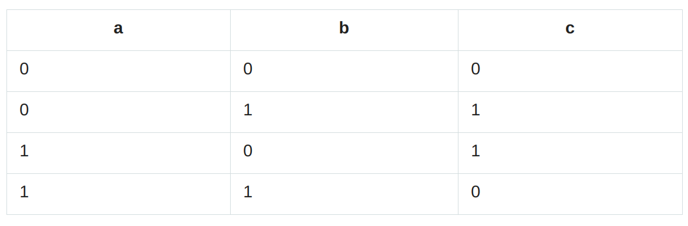
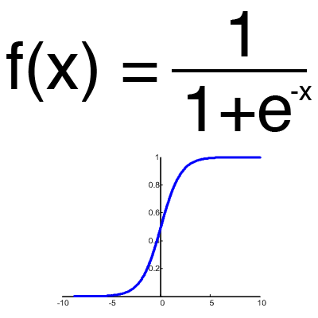

# Supervised feed-forward Neural Network from scratch
Brief description:
After I read these articles from Habr.com:
 [First article](https://habr.com/ru/post/312450/)  
[Second article](https://habr.com/ru/post/313216/)  
I decided to create my own neural network with the activation function and everything programmed from scratch

***
# What it can do
This program was designed to train the Neural Network how to solve the **XOR** task:

Two input neurons for the values **a** and **b**  
One output neuron for the **c** result of the operation **a** XOR **b** = **c**  
# How to use
1. In the file `Initializer.kt` you can choose the version and run it.
2. Choose *loadWeightsFromFile = `true`* if you want to load taught neural network from the file `src/resources/myNeuralNetwork`
* Else specify amount of epochs to teach with *epochsToTeach* property.
Also it will update current weights saved in the src/resources/myNeuralNetwork file.
##### To configure network hyperparameters you can adjust them inside of the version class:
* val I_neuronsCount = 2    `Input neurons quantity`
* val O_neuronsCount = 1    `Output neurons quantity`
* val layersCount = 2       `Hidden layers quantity`
* val neuronsPerLayer = 3   `Neurons per hidden layer`
***
# NN architecture
### Bias neuron is present.
### Activation function:

### Teaching method:
***Supervised*** stochastic (updating weights immediately)
